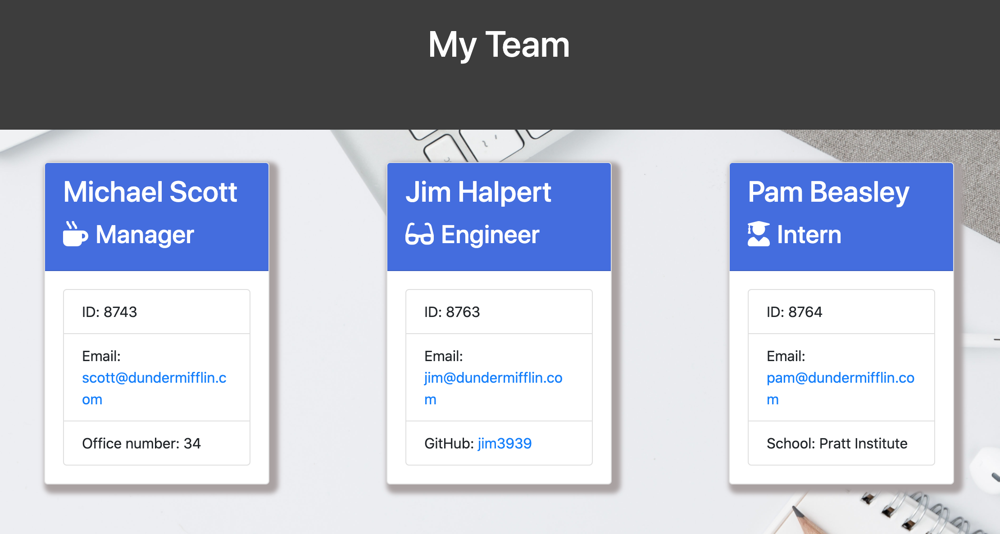

[](https://opensource.org/licenses/MIT)
  # Employee Summary

  

  ## Table of Contents
  * [Description](#description)
  * [Installation](#installation)
  * [Usage](#usage)
  * [Contributing](#contributing)
  * [Tests](#tests)
  * [Questions](#questions)
  * [License](#license)

  ## Description
  This project is a command line interface that takes a user's input of employee data and dynamically generates a webpage with that information. There are three types of employees available: manager, engineer, and intern, each with their own specific questions. Once a user fills out the manager's information, they can add as many engineers or interns to the team as they so desire. The command line application is built on the inquirer package and classes are instantiated for each employee to store the appropriate details. 
  ## Installation
  A package.json file is included with all of the necesssary installs to have this package functioning. The essential dependency is the inquirer package which enables the command line interface.
  ## Usage
  The following link is a walkthrough of the applications functionality:
  
  [screencastify](screencastifylink.com)
  ## Contributing
  Special thanks to the Inquirer package for the CLI and GA Tech Bootcamp for the necessary tools and information.
  ## Tests
  This project was designed with jest test driven development. There are four test files for each of the classes built for employee types. Jest can be installed by running ```npm i``` in the terminal and executed with ```npm run test```. 
  ## Questions
  Github profile: [dgtlctzn](https://github.com/dgtlctzn)
  
  If you have any questions about the project please contact josephperry720@gmail.com
  ## License
  This project is covered under the MIT license
